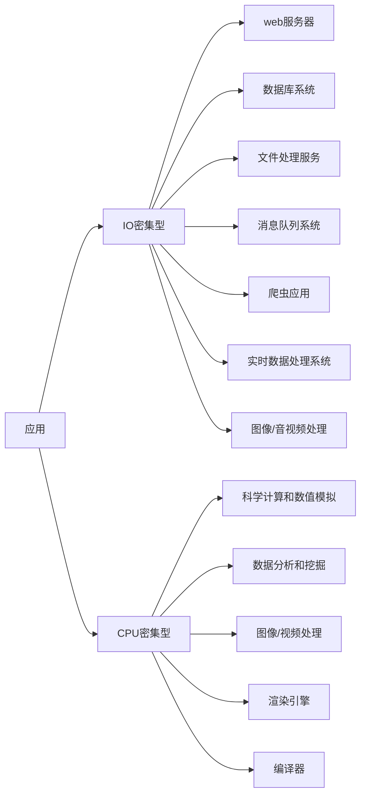

# 我的思维导图

## 应用

**服务端应用**

> 服务类应用以API居多大致分为两类

- IO密集型
  - Web服务器
  - 数据库系统
  - 文件处理系统
  - 消息队列
  - 爬虫
  - 实时数据处理系统
- CPU密集型
  - 科学计算和数字模拟
  - 数字分析和挖掘
  - 图像/视频处理
  - 渲染引擎
  - 编译器

### 思维导图

### 问题解答

#### IO密集型

1. **特点：**
   - 主要的性能瓶颈在于输入/输出操作，如文件读写、网络通信、数据库查询等。
   - 频繁地进行异步、非阻塞IO操作。
2. **优化策略：**
   - 使用异步IO，减少阻塞时间。
   - 使用线程池或事件驱动模型，提高并发性。
   - 考虑使用缓存来减少对外部资源的频繁访问。
3. **典型应用场景：**
   - Web服务器：处理大量的HTTP请求和响应。
   - 数据库应用：执行大量的数据库查询和更新操作。
   - 文件处理服务：读写大量文件。

#### CPU密集型

1. **特点：**
   - 主要的性能瓶颈在于计算密集型的任务，需要大量的CPU运算。
   - 对IO操作的需求相对较少。
2. **优化策略：**
   - 使用多线程或多进程来充分利用多核CPU。
   - 考虑并行计算，将任务分解成多个子任务并行执行。
3. **典型应用场景：**
   - 图像处理：如图像识别、图像处理算法。
   - 科学计算：如数值模拟、仿真。
   - 数据分析：对大量数据进行复杂计算和统计。

