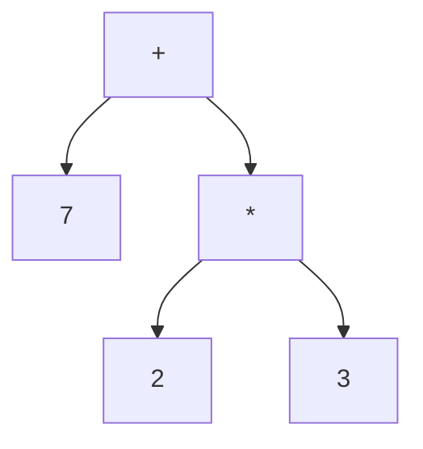
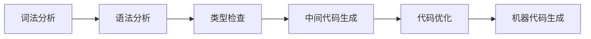
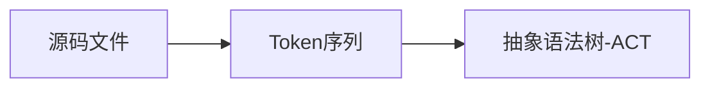
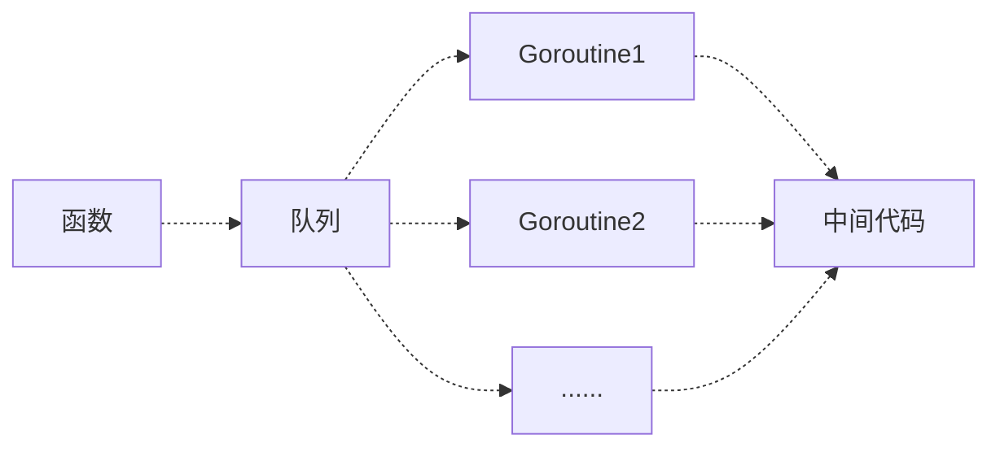

# Go语言是如何运行的？

**Go是什么？**

> Go 是一个开源的编译型语言，在多核并发上拥有原生的设计优势，从底层原生支持并发。（Go语言的并发是基于 `goroutine` 的）
>
> Go 通过自动垃圾回收、边界检查、类型安全的指针、安全的标准库等方式，致力于提供内存安全性。

****

### Go编译过程

> Go需要通过编译器生成二进制机器码，这样才能在目标机器运行。
>
> 编译器分为一下四个步骤，词法语法分析->类型检查->中间代码生成->机器码生成
>
> 编译中说需要理解的术语及基础知识，抽象语法树，静态单赋值

**LEX (生成词法分析器的工具**

> LEX用于生产词法分析器的工具，将文件中的字符分解成Token序列，可以吧LEX理解为正则匹配的生成器。
>
> LEX生成器使用了C语言的语法

**抽象语法树**

> 抽象语法树（abstract synctax tree AST）是源代码语法结构的一种抽象表示，他用树状结构的方式用来表示语法结构

```go
#源代码
x := 2 * 3 + 7
#语法树
```



**静态单赋值**

> 静态单赋值（static single assignment， SSA）是指每个变量只会被赋值1次，他是中间代码的特性。他的实现方式通常采用下标方式实现

```go
#源代码
x := 1
x := 2
y := x
#编译模式
x_1 := 1
x_2 := 2
y_1 := x_2
```

在机器码编译过程中 `x_1 := 1` 就会被优化掉； SSA 的主要作用就是对代码进行优化

**指令集**

> 常见的指令集 `x86_64` `arm64` 后者常见于 `mac` 在我们安装应用时，经常会出现 `windows` `mac` 版本，所以需要将源码根据不同的指令集架构翻译成不同的机器语言以供使用。

- 复杂指令集计算机

> 通过增加指令的类型，减少需要执行的指令数量

- 精简指令集计算机

> 使用较少的指令类型，完成目标计算任务

#### 编译阶段

> 编译核心过程又可以细分为，词法分析->语法分析->类型检查->中间代码生成->代码优化->机器代码生成



**词法/语法分析**

> 词法分析的作用就是解析源代码文件，将文件中字符串序列转为 Token 序列。
>
> 上述这种过程称之为：**词法分析器**  通过此法分析器 Go 源文件会最终被归纳为一个 SourceFile 结构（语法树）

```
SourceFile = PackageClaus ";" { ImportDecl ";"} {TopLevelDecl ";"}

#示例
"test.go" : SourceFile {
		PackageName : "test",
		ImportDecl : []Import {
			"fmt"
		},
		TopLevelDecl : ...
}
```




**类型检查**

> 检查语法树中定义和使用的类型。
>
> 类型检查在整个编译过程中非常重要，Go很多关键字依赖类型，在检查期间的改写。

```sequence
抽象语法树 -> 类型检查: 生成抽象语法树

类型检查 --> 类型检查: 遍历检测每一个节点
类型检查 --> 类型检查: 优化代码
类型检查 --> 类型检查: 修改make、new等对应节点的操作类型

类型检查 -> 抽象语法树: 更新优化抽象语法树
```


类型检查会按照一下顺序

```
##### 类型检查顺序 #####
1. 常量、类型，函数名及其类型
2. 变量的赋值和初始化
3. 函数和闭包的主体
4. 哈希表类型
5. 导入函数体
6. 外部声明

// 1. 常量、类型，函数名及其类型
package main
import "fmt"
const Pi = 3.14159
type Circle struct {
    Radius float64
}
func CalculateArea(c Circle) float64 {
    return Pi * c.Radius * c.Radius
}

// 2. 变量的赋值和初始化
func main() {
		var radius float64
    radius = 5.0

    var myCircle Circle
    myCircle.Radius = radius

    area := CalculateArea(myCircle)
    fmt.Printf("Circle Area: %f\n", area)
}

// 3. 函数和闭包的主体
    greet := func(name string) string {
        return "Hello, " + name
    }

    message := greet("John")
    fmt.Println(message)
    
// 4. 哈希表类型
    person := map[string]int{
        "John": 30,
        "Jane": 25,
    }

    fmt.Println("John's age:", person["John"])
    
// 5. 导入函数体
    fmt.Println("Square root of 16:", mySqrt(16))
    
// 6. 外部声明
// mySqrt 是一个简单的求平方根的函数
func mySqrt(x float64) float64 {
    return x * x
}
```

**中间代码生成**

> 中间代码是编译器或者虚拟机使用的语言，中间代码是为了简化编译器的复杂场景，是在编程语言到机器码中间的步骤。中间代码具有SSA的特性
>
> 通过转换为抽象语法树，在通过类型检查，也就是意味着当前抽象语法树已经不存在任何错误。
>
> 故此将抽象语法树转换为中间代码

在类型检查之后，编译器通过  `cmd/compile/internal/gc.compileFunctions` 编译整个 Go 项目中全部函数，会在一个编译队列中等待多个 Goroutine 消费并发执行转换为中间代码



**机器码生成**

> Go 源码中 `src/cmd/compile/internal` 目录包含了多种机器码生成相关包，包括 AMD64、ARM、ARM64、MIPS、MIPS64、ppc64、x86、Wasm（webassembly）

```sh
## wasm
GOARCH=wasm GOOS=js go build -o lib.wasm main.go
## amd64
GOARCH=amd64 GOOS=linux go build -o myapp main.go
## arm64
GOARCH=arm64 GOOS=linux go build -o myapp main.go
```


### Go runtime

> "runtime" 通常指的是 Go 的运行时系统，它是 Go 语言的一部分，负责管理 Goroutines（轻量级线程）、垃圾回收、内存分配等。Go 的 `runtime` 还提供了对并发编程的支持，包括通道（channels）和互斥锁等。

**goroutines**

> 是 Go 语言中的一个核心概念，用于并发编程。由 Go 的运行时系统（runtime）管理
>
> 自动调度：Go 的运行时系统会自动在多个线程之间调度 goroutines，使得程序能够更好地利用多核处理器。
>
> Goroutines 之间相互独立且可以通过 channel 互相通信

goroutines并发代码示例

```go
### 你可以通过 go 关键字启动一个新的 goroutine，这样函数就会在一个新的 goroutine 中异步执行，不会阻塞当前的执行流程。
go func() {
    // 你的代码
}()

### goroutines 之间的通信，通过（channel）完成。chan 是一种用来在 goroutines 之间传递数据的机制。
ch := make(chan int)
go func() {
    ch <- 42
}()
value := <-ch
```

**垃圾回收**

> 垃圾回收机制，主要用于回收内存中已存在但是已经不在使用的内容

- 标记清除算法

> 1. 标记 - 从跟对象出发查找，并且标记对中所有存活的对象
> 2. 清除 - 遍历堆中全部对象，回收被标记的垃圾对象，并将回收的内存加入空闲链表

- 三色抽象算法

> 三色抽象 - 顾名思义通过三种颜色用来标记对象，所有的**根对象**初始色都为灰色
>
> 1. 白色 - 潜在的垃圾，器内存可能会被垃圾回收器回收
> 2. 黑色 - 活跃的对象，包括不存在引用指针的对象，以及跟对象和他可到达的对象
> 3. 灰色 - 活跃的对象，垃圾回收器会先扫描灰色

三色抽象的工作原理

1. 从灰色对象中选择灰色标记为黑色
2. 将黑色指向的对象标记会灰色（保证该对象和被引用的对象不会被回收
3. 重复上述步骤

实现原理

1. 清除阶段

2. 清除终止

3. 标记阶段

4. 标记终止

5. 清除阶段

   

- 屏障技术

> 为了保障本不应该被回收的对象，被回收。（悬挂指针）


**内存分配**

-  **线性分配器**
- **空间链表分配器**

**channels**

**互斥锁**

